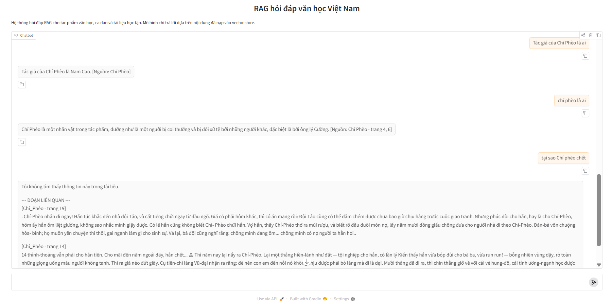
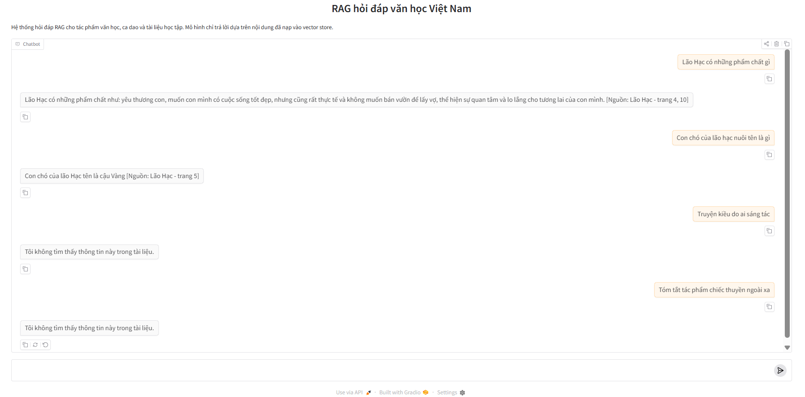

# 🚀 RAG hỏi đáp văn học Việt Nam

Hệ thống hỏi đáp văn học Việt Nam sử dụng **Retrieval-Augmented Generation (RAG)**, được thiết kế nhằm nâng cao độ chính xác trong hỏi đáp bằng cách tích hợp cơ chế truy xuất ngữ cảnh với mô hình ngôn ngữ lớn, giúp đảm bảo câu trả lời luôn dựa trên nguồn dữ liệu đã được cung cấp.

### 🌟 Tính năng nổi bật
* **🔍 Tìm kiếm ngữ nghĩa (Semantic Search):**
Sử dụng embedding + vector database (Chroma) để tìm đoạn văn liên quan thay vì chỉ match từ khóa.
* **📚 Hỗ trợ nhiều tác phẩm văn học:**
Có thể mở rộng dễ dàng với các tài liệu như truyện, ca dao, thơ,...
* **🎯 Nhận diện tác phẩm trong câu hỏi:**
Tự động phát hiện người dùng đang hỏi về tác phẩm nào để lọc kết quả chính xác hơn.
* **🧠 Trả lời dựa trên ngữ cảnh (Context-aware QA):**
Mô hình chỉ trả lời dựa trên dữ liệu đã retrieve, hạn chế hallucination.
* **⚠️ Cơ chế fallback thông minh:**
Nếu không đủ thông tin:
Trả về thông báo chuẩn hoặc hiển thị đoạn liên quan (trong trường hợp phù hợp)
* **🚫 Giảm nhiễu kết quả (Relevance Filtering):**
Lọc các đoạn văn có độ liên quan thấp để tránh trả lời sai hoặc không liên quan.
* **🧹 Xử lý dữ liệu tiếng Việt tốt hơn:**
Chuẩn hóa Unicode, bỏ dấu khi cần, hỗ trợ match tên tác phẩm tiếng Việt.
* **💬 Giao diện chat thân thiện (Gradio UI):**
Dễ sử dụng, có sẵn câu hỏi mẫu, trải nghiệm giống chatbot thực tế.

### 🛠 Tech Stack
| Thành phần | Công nghệ | Vai trò |
| :--- | :--- | :--- |
| AI / LLM | Groq (LLaMA) | Sinh câu trả lời dựa trên context |
Framework | LangChain | Xây dựng pipeline RAG, quản lý prompt & chain |
Vector DB | ChromaDB | Lưu trữ embedding và truy vấn ngữ nghĩa |
Embedding | HuggingFace | Chuyển văn bản thành vector |
Backend	| Python | Ngôn ngữ chính của hệ thống |
UI | Gradio | Giao diện chat cho người dùng |
Config | dotenv (.env) | Quản lý API key và cấu hình |
Data Processing | Regex, Unicode, Pathlib | Làm sạch và xử lý dữ liệu |
### ⚙️ Luồng Hoạt Động

Hệ thống hoạt động theo một luồng xử lý thông minh, bắt đầu từ câu hỏi của người dùng và kết thúc bằng câu trả lời do mô hình ngôn ngữ (LLM) tạo ra dựa trên dữ liệu truy xuất được.

#### **1. Giao Diện Người Dùng**
Người dùng nhập câu hỏi vào giao diện chat được xây dựng bằng Gradio.

Hệ thống phân tích câu hỏi để xác định xem người dùng có đang hỏi về một tác phẩm cụ thể hay không.

* Nếu có → ưu tiên tìm trong đúng tác phẩm đó
* Nếu không → tìm trên toàn bộ dữ liệu
#### **2. Truy Xuất Dữ Liệu (Retrieval)**
* Câu hỏi được chuyển thành vector embedding
* Hệ thống truy vấn ChromaDB (vector database)
* Lấy ra các đoạn văn (chunk) có độ tương đồng cao nhất với câu hỏi.

Ngoài ra:

* Áp dụng lọc theo độ liên quan (relevance score)
* Loại bỏ các đoạn trùng lặp
#### **3. Tạo Ngữ Cảnh (Context Construction)**

Các đoạn văn liên quan được:

* Gắn metadata (tên tác phẩm, số trang)
* Ghép lại thành một context hoàn chỉnh

Context này sẽ được dùng làm nguồn tri thức cho LLM.

#### **4. Sinh Câu Trả Lời (Generation)**

Hệ thống:

* Kết hợp câu hỏi + context
* Đưa vào prompt template
* Gửi đến mô hình LLM (Groq / LLaMA)

LLM sẽ:

* Phân tích ngữ cảnh
* Sinh câu trả lời phù hợp
* Không sử dụng kiến thức ngoài context
#### **5. Cơ Chế Kiểm Soát (Fallback)**

Nếu:

* Không tìm thấy dữ liệu phù hợp\
* Hoặc context không đủ để trả lời

→ Hệ thống trả về:
~~~
Tôi không tìm thấy thông tin này trong tài liệu.
~~~
Trong một số trường hợp:

* Có thể hiển thị thêm đoạn liên quan để người dùng tham khảo
#### **6. Trả Kết Quả**

Câu trả lời cuối cùng được hiển thị trên giao diện Gradio.

Tùy trường hợp:

* Chỉ hiển thị câu trả lời (khi chắc chắn)
* Hoặc kèm theo: đoạn liên quan / nguồn trích dẫn

### 📁 Cấu trúc thư mục

```text
RAG/
├── data/
│   ├── raw/                  # dữ liệu gốc: PDF/TXT/DOCX
│   ├── processed/            # text/chunk đã xử lý, có thể lưu JSON để debug
│   └── vector_store/         # Chroma DB hoặc vector index đã persist
│
├── src/
│   ├── ingest/
│   │   ├── loader.py         # đọc file đầu vào và gắn metadata
│   │   ├── cleaner.py        # làm sạch, chuẩn hóa tiếng Việt
│   │   └── chunker.py        # chia chunk cho retrieval
│   │
│   ├── embedding/
│   │   └── embedder.py       # khởi tạo embedding model
│   │
│   ├── retrieval/
│   │   ├── indexer.py        # build/load Chroma vector store
│   │   └── retriever.py      # retrieve top-k, ưu tiên lọc theo tác phẩm
│   │
│   ├── generation/
│   │   ├── prompt.py         # prompt system và prompt answer
│   │   └── generator.py      # gọi LLM để sinh câu trả lời
│   │
│   ├── pipeline/
│   │   └── rag_pipeline.py   # ghép retrieve + generate thành pipeline hoàn chỉnh
│   │
│   ├── evaluation/
│   │   └── evaluate.py       # script đánh giá đơn giản cho retrieval/answer
│   │
│   ├── utils/
│   │   ├── config.py         # cấu hình chung toàn project
│   │   └── helpers.py        # hàm phụ trợ xử lý metadata và I/O
│   │
│   └── app.py                # giao diện Gradio
│
├── tests/
├── notebooks/
├── .env                      # lưu trữ API key quan trọng
├── requirements.txt          # chứa các thư viện cần thiết để cài đặt
└── README.md
```
### 🚀 Hướng dẫn Cài đặt & Sử dụng
#### **1. Clone dự án về máy**
```bash
git clone [https://github.com/your_username/RAG_pdf_txt.git]
cd RAG_pdf_txt
```
#### **2. Cài đặt các thư viện cần thiết và môi trường**
* Tạo môi trường ảo và kích hoạt nó
```bash
python -m venv venv
# Trên Windows
venv\Scripts\activate
# Trên macOS/Linux
source venv/bin/activate
```
* Cài đặt thư viện cần thiết từ file `requirements.txt`
```bash
pip install -r requirements.txt
```
#### **3. Cấu Hình API Key**

Dự án yêu cầu **API key** từ **Groq** để sử dụng mô hình ngôn ngữ lớn (**LLM**) trong hệ thống RAG.

Tạo một tệp `.env` ở thư mục gốc và thêm:

```
GROQ_API_KEY = "YOUR_API_KEY"
```
Bạn có thể lấy **API key** tại [**Groq Console**](https://console.groq.com/keys).

#### **4. Chạy Ứng Dụng**

Sau khi đã cài đặt và cấu hình xong, thực hiện các bước sau để chạy hệ thống:

**Bước 1:** Build vector database
~~~
python -m src.retrieval.indexer
~~~
Bước này sẽ:

* Đọc dữ liệu từ `data/raw/`
* Chia nhỏ (chunk)
* Tạo embedding
* Lưu vào `data/vector_store/`

**Bước 2:** Chạy ứng dụng
~~~
python -m src.app
~~~

### ❓ Cấu trúc xử lý câu hỏi

Hệ thống xử lý câu hỏi theo 3 trường hợp chính:

#### 1. Có đủ ngữ cảnh và có thể suy luận ra đáp án

Nếu các đoạn văn được truy xuất chứa đủ thông tin để mô hình hiểu và trả lời chắc chắn, hệ thống sẽ sinh ra câu trả lời trực tiếp dựa trên ngữ cảnh.

#### 2. Có ngữ cảnh liên quan nhưng không đủ để kết luận chính xác

Nếu hệ thống tìm được các đoạn văn liên quan, nhưng nội dung đó không chứa đáp án rõ ràng, mô hình sẽ không suy đoán thêm. Thay vào đó, hệ thống sẽ:

* thông báo: Tôi không tìm thấy thông tin này trong tài liệu.
* hiển thị đoạn liên quan để người dùng tự tham khảo

3. Không có thông tin phù hợp trong tài liệu

Nếu câu hỏi không liên quan đến dữ liệu trong hệ thống, hoặc không truy xuất được ngữ cảnh phù hợp, hệ thống sẽ trả về đúng thông báo:
~~~
Tôi không tìm thấy thông tin này trong tài liệu.
~~~
---
### 📸 Demo



